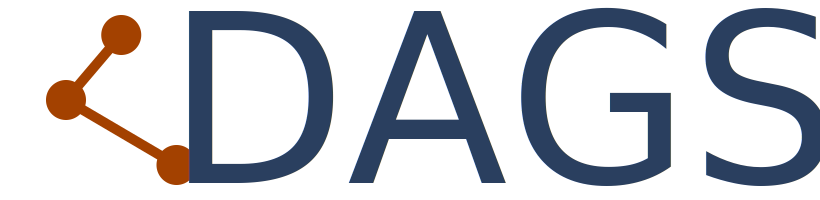

|

About dags
==========

dags provides tools to combine several interrelated functions into one function.
The order in which the functions are called is determined by a topological sort on
a Directed Acyclic Graph (DAG) that is constructed from the function signatures.

.. toctree::
    :maxdepth: 1

    installation
    examples
    api

Who uses dags
=============

dags is used by the following open source projects:

- `GETTSIM <https://github.com/iza-institute-of-labor-economics/gettsim>`_
- `LCM <https://github.com/OpenSourceEconomics/lcm>`_
- `Skillmodels <https://github.com/janosg/skillmodels/tree/main/skillmodels>`_

dags is a tiny library, all the hard work is done by the great
`NetworkX <https://networkx.org/documentation/stable/tutorial.html>`_.
